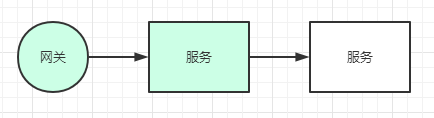

# 灰度发布落地实战1

### 蓝绿发布：

优点：无缝的升级服务

缺点：消耗资源大，2倍的机器


### 滚动发布：

优点：也能实现无缝的升级服务，同时节约机器

缺点：发布当中，如果出现了问题，不好排查，到底是新系统的BUG还是老系统的BUG


### 灰度发布：

优点：新功能让一小部分人使用，相当于Beta版，不会影响主业务

如果该新功能反应效果好，再升级为所有人使用，如某信的“拍一拍”功能

实现新功能， a b testing，尽量减少用户使用的时延

节省了服务器，延时，和试错成本

---

#### Java落地代码实现：


#### 第一种方案，基于网关Zuul + ribbon实现（用到Eureka的 metadata）

原理：用户请求打到 Zuul，filter中取得request header中的 userId字段，根据不同的规则，使用ribbon转发到不同的服务（根据eureka cilent 中的 metadata）

用户 --> Zuul --> 服务A



项目结构介绍：

cloud-eureka：7900

cloud-zuul：9100

service-sms：8003 和 8004


在cloud-zuul中定义了GreyFilter：

```java
@Component
public class GreyFilter extends ZuulFilter {

    /**
     * 注意这里的 filter type 类型为 ROUTE_TYPE，路由过程中的
     * @return
     */
    @Override
    public String filterType() {
        return FilterConstants.ROUTE_TYPE;
    }

    @Override
    public int filterOrder() {
        return 0;
    }

    @Override
    public boolean shouldFilter() {
        return true;    //打开
    }

    @Override
    public Object run() throws ZuulException {
        RequestContext currentContext = RequestContext.getCurrentContext();
        HttpServletRequest request = currentContext.getRequest();

        //这里获取的是request header中 userId
        //也可以使用 token等自定义请求头
        //根据token解析用户，然后根据用户规则表，找到对应的metadata
        int userId = Integer.parseInt(request.getHeader("userId"));

        // 根据用户id 查 规则  可以是查库 v1,meata 也可以查Redis 或者本地缓存
        // ...这里简略
        // 数据库表可以这样设计： id | user_id | service_name | meta_version
        //这里只是简单实现了转发规则，userId == 1的 转发到 metadata version = v1的服务

        // 金丝雀（灰度发布）
        if (userId == 1){
            ////这里的 version 和 v1 信息，是配置在 service-sms项目 eureka metadata中
            RibbonFilterContextHolder.getCurrentContext().add("version","v1");
            // 普通用户
        }else if (userId == 2){
            RibbonFilterContextHolder.getCurrentContext().add("version","v2");
        }

        return null;
    }
}
```


网关zuul 项目 yml配置：

```
zuul:
  routes:
    #此处名字随便取
    custom-zuul-name:
      path: /zuul-custom-name/**
      service-id: service-sms
```


service-sms 项目定义服务接口：

```
@RestController
@RequestMapping("/test")
public class ServiceSmsTestController {

    @Value("${server.port}")
    private String port;

    @GetMapping("/sms-test2")
    public String test2(){
		//启动了8003 和 8004，为了辨别是哪个服务，打印端口号
        return "sms-test2:"+port;
    }
    
}
```


service-sms 项目 yml 关键处：

```
---
spring:
  profiles: v1

eureka:
  instance:
    metadata-map:
      # 以下内容是自定义的 K V，可以通过eureka http post修改
      version: v1
server:
    #服务端口
  port: 8003
  
---
spring:
  profiles: v2

eureka:
  instance:
    metadata-map:
      version: v2
server:
    #服务端口
  port: 8004
```


注意 8003 使用的metadata-map是 version = v1

8004 使用的是 version = v2


通过Postman发送请求，Request Header 里 添加 userId = 1

```
http://localhost:9100/service-sms/test/sms-test2
```


测试时，所有userId=1的用户，访问均是 8003 端口的服务

userId=2的时候，所有请求都访问的 8004 的服务

其他情况，也是默认情况，在8003 和 8004之间轮询访问


规则可以写灵活，不需要重启系统：

通常在后台系统设置，写入DB，或者Redis

需要注意的是，需要与eureka metadata同步，改了DB，也需要发送请求修改metadata

参见：https://github.com/Netflix/eureka/wiki/Eureka-REST-operations  Update metadata 章节


项目代码地址：

https://github.com/kennedy-han/grey-notice-zuul